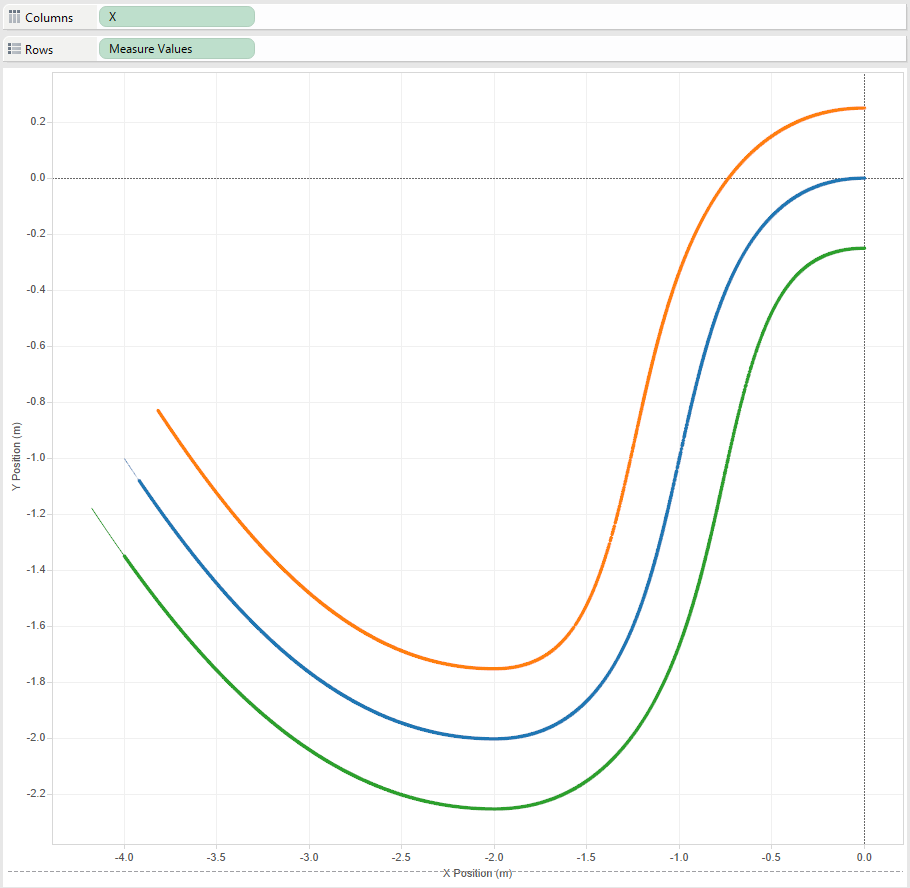
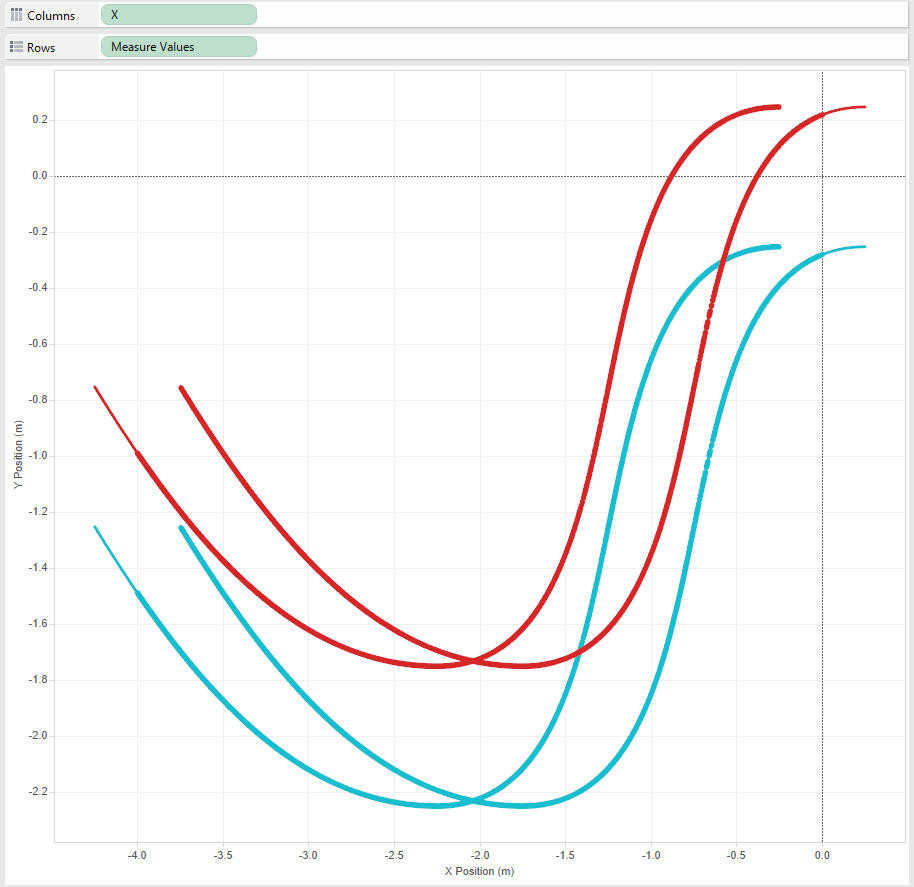

# Pathfinder
Cross-Platform, Multi-Use Motion Profiling and Trajectory Generation.

Pathfinder is a library for generating Motion Profiles, a way to smoothly fit and follow a trajectory based upon 
given waypoints. Currently, both a C and Java API are available, but can be applied to almost any application.

An example profile is given below, with the waypoints:  
1) X = -4, Y = -1, Angle = -45 degrees  
2) X = -2, Y = -2, Angle = 0  
3) X = 0,  Y = 0,  Angle = 0

The Graph on top is the X/Y position, and the Graph on the bottom is the Velocity.  


## Modifiers
Pathfinder supports Modifiers. Modifiers are a way to manipulate a trajectory with a given rule.  
Pathfinder supports Tank and Swerve Drive modifiers.  

Tank Drive:  


Swerve Drive:  


## Part of the FIRST Robotics Competition?
We've got some Wiki Entries for you. After you've read this README, go to the [wiki](https://github.com/JacisNonsense/Pathfinder/wiki/) 
to learn more about how to integrate Pathfinder into your FRC application!

## Building
To build the project, run the following command:
```
./gradlew build
./gradlew assemble
```

To build the C code only:
```
./gradlew :Pathfinder-Core:build
```

To build the Java code:
```
./gradlew :Pathfinder-Java:build
./gradlew :Pathfinder-Java:assemble
```

This will build for both the x64 and x86 architecture for your platform. To cross compile for ARM, do the following:
```
./gradlew build -Parm -PcompilerPrefix=arm-linux-gnueabi
./gradlew assemble
```

## Installing on your Architecture
If your OS or Architecture doesn't fall under the prebuilt binaries that are available with the library, you can 
install pathfinder's native binaries onto your local system manually. This will allow you to include the library
in any project you want

64-Bit
```java
./gradlew install
```

32-Bit
```java
./gradlew install -P32
```

If you want to change the prefix location (by default it is `/usr/local`), you can pass the `prefix` property:
```java
./gradlew install -Pprefix=<your prefix location>
```

## Usage
To see the usage for each language variation of the API, see the README in their folder.

| Language | Folder |
| -------- | ------ |
| C        | [Pathfinder-Core](Pathfinder-Core/) |
| Java     | [Pathfinder-Java](Pathfinder-Java/) |